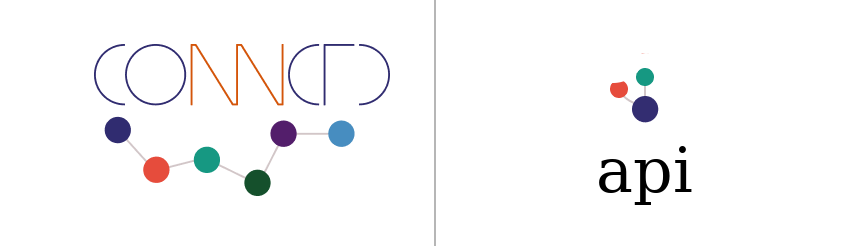

# DEPRECATED

This repo is now integrated into the connector-go SDK at https://github.com/connctd/connector-go.
Please use the SDK instead and update your dependencies.
The code can now be found at https://github.com/connctd/connector-go/tree/main/api/.

  

# Api Go

This repository holds arbitrary models and functions that are useful to externally hosted services or connectors working with our platform.

